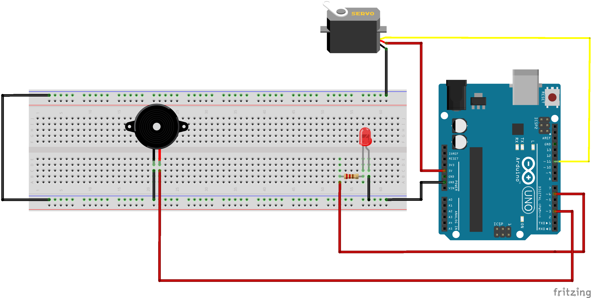

Twitter celebration
===================

To run this example run:
```
npm install
```
rename ```settings.example.json```to ```settings.json``` and change
the twitter authentication data.
```
cd src/ && node main.js SEARCH_QUERY
```
Breadboard/Illustration
-----------------------



Demo video
----------

https://drive.google.com/file/d/0B4V8YsfL0DCuR19LcUttYzdHT2c/view?usp=sharing

